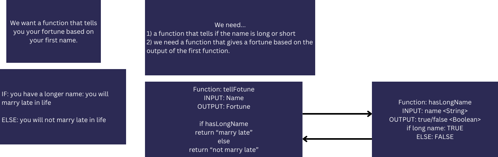
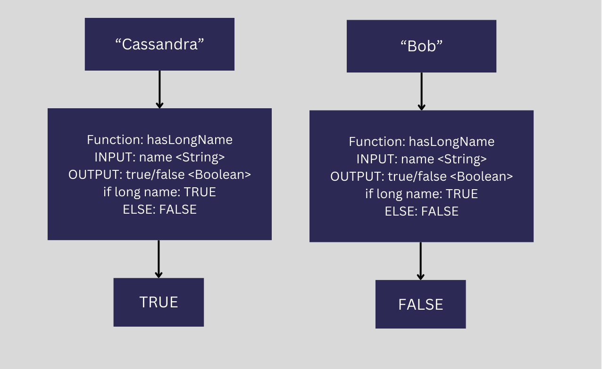

# JavaScript-Validation-02

## Day 1-2

We will make a function to tell someones' fortune based on their first name.

## Whiteboards

### Whiteboard for Day 2

overview of `tellFortune()`

example of `hasLongName()`

